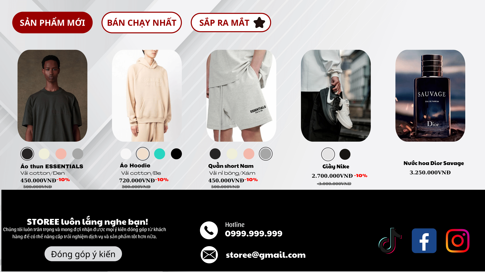
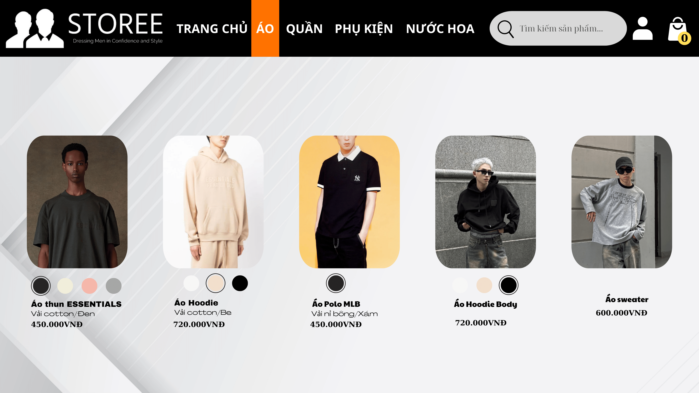
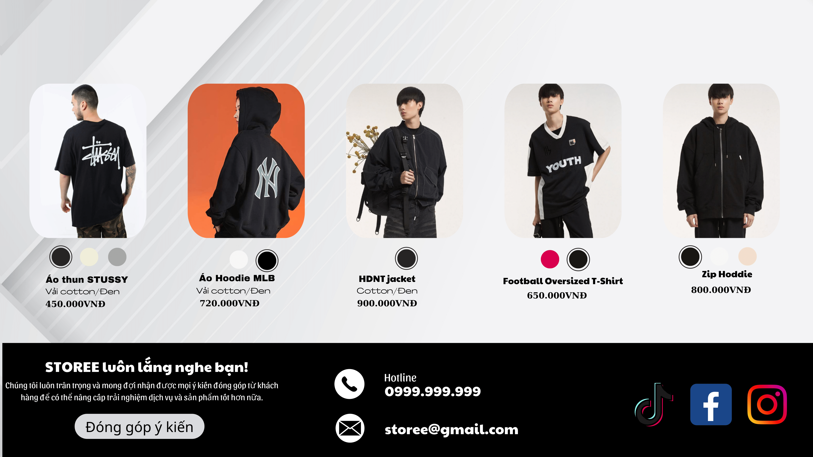
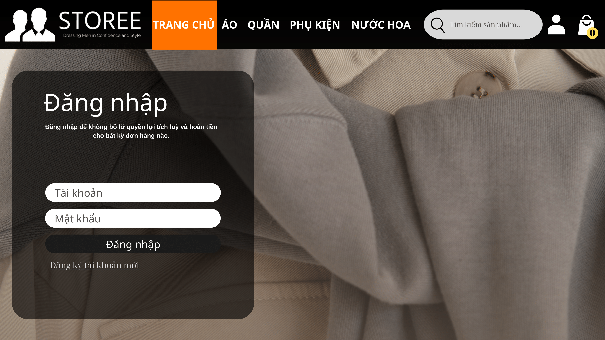
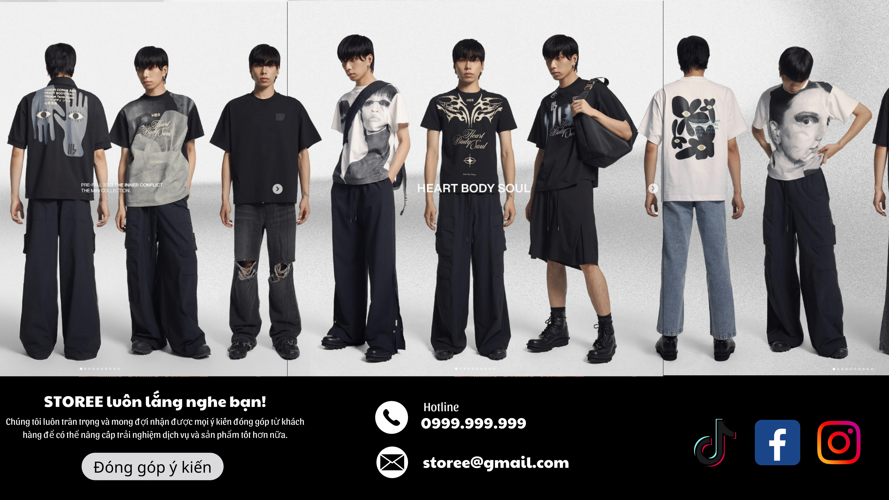
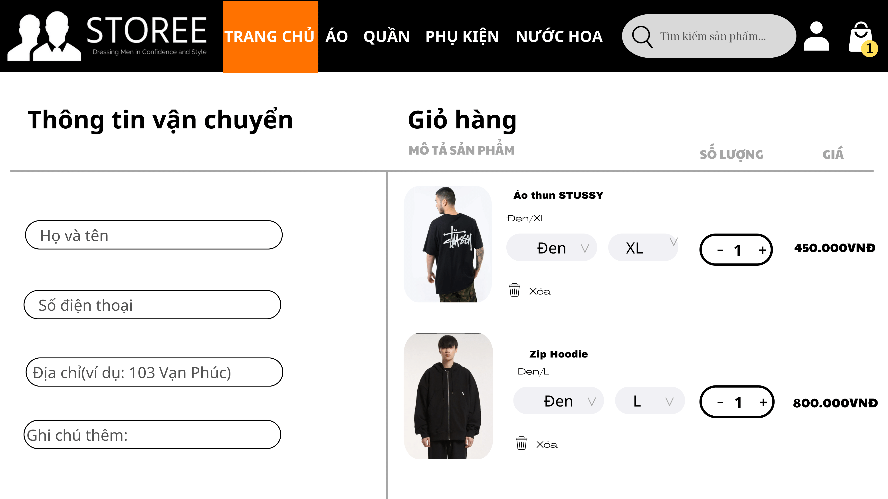
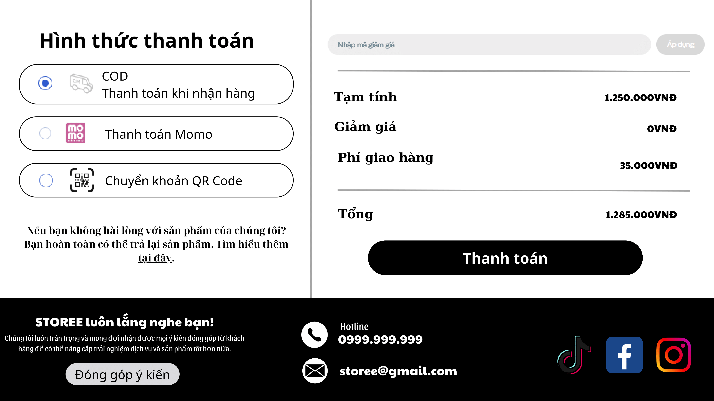
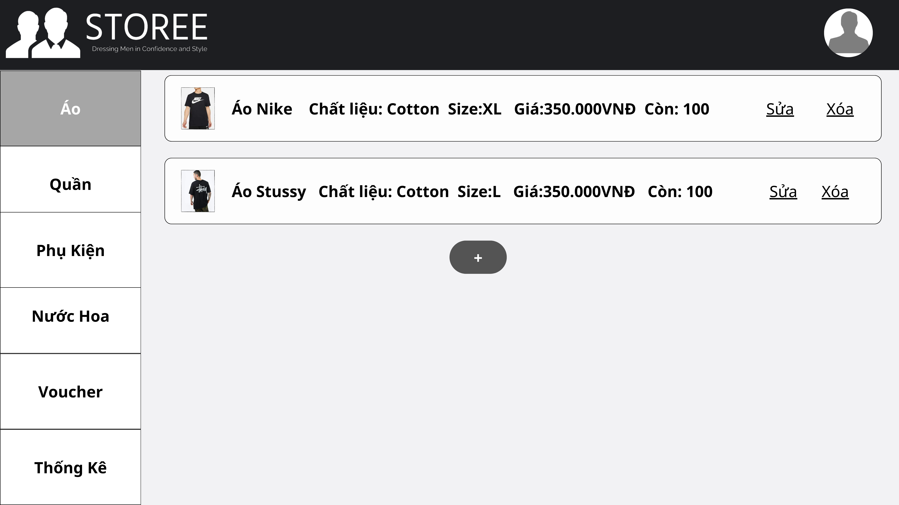
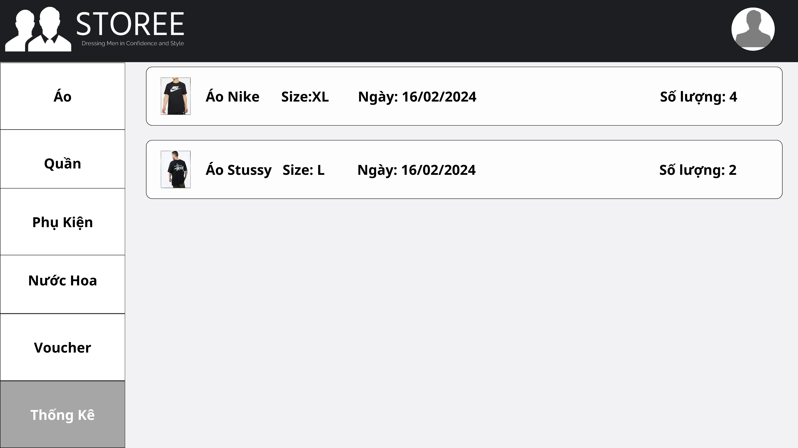
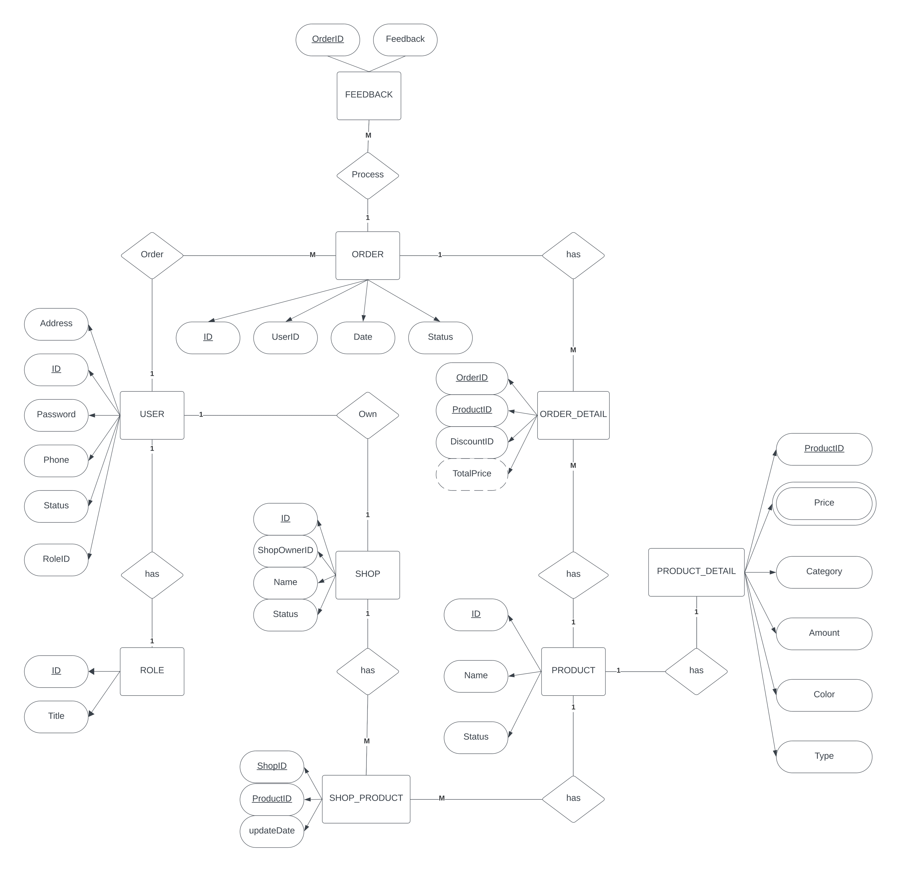

# Assignment
## Members:
SE184022 - Vo Huy Hoang  
SE183970 - Vo Khac Xuan Nguyen  
SE183990 - Dang Minh Duc  
SE183965 - Tran Nguyen Viet Thanh  

## 1. Requirements

#### Name of the system:
Storee.

#### Purpose:
Selling and buying clothes base on customer’s personal character. Users can provide their preferences, and the website will generate a list of products based on them.

#### Who use the system?
Customer: searching, buying, writing feedbacks about products.  
Seller: upload product for selling secondhand.  
Admin: manage products, add new voucher.  

#### List of features:
User:
- Register/ Login
- Search for clothes
- View informations about a product
- Add product to cart
- Write feedbacks
- Add voucher to payment (if any)
- Choose for paying methods

Seller:
- Upload a product to sell

Admin:  
- Manage products (add, delete, approve products,...)
- Add new voucher to database
  

## 2. Wireframe or screenshots of the system:
> Home Page
  
  

> Search Page
  

> Register/ Login
  

> Select payment
  

> Admin page

 

> ERD

> Relations

